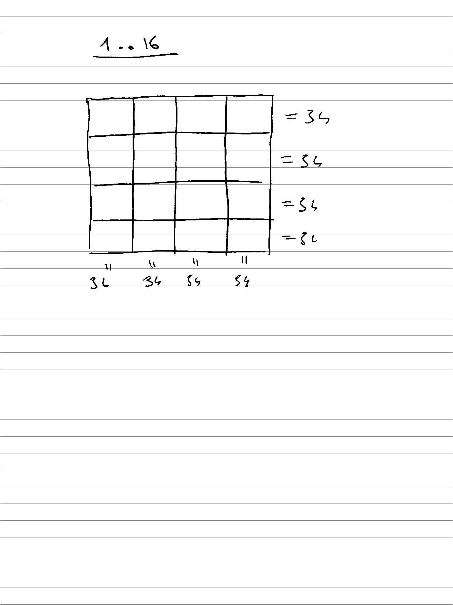

# vanja-16-task

## In action:
https://asciinema.org/a/uXR2KpaQ3wqDUPBa7dgFBCOS2

## In code editor:
https://dotnetfiddle.net/McSBvx

## Problem:
Put numbers from 1 to 16 in a 4x4 grid so the sum in rows and columns equals 34.

